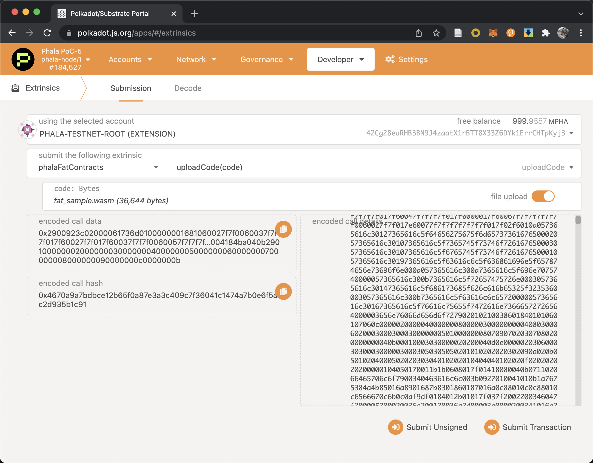
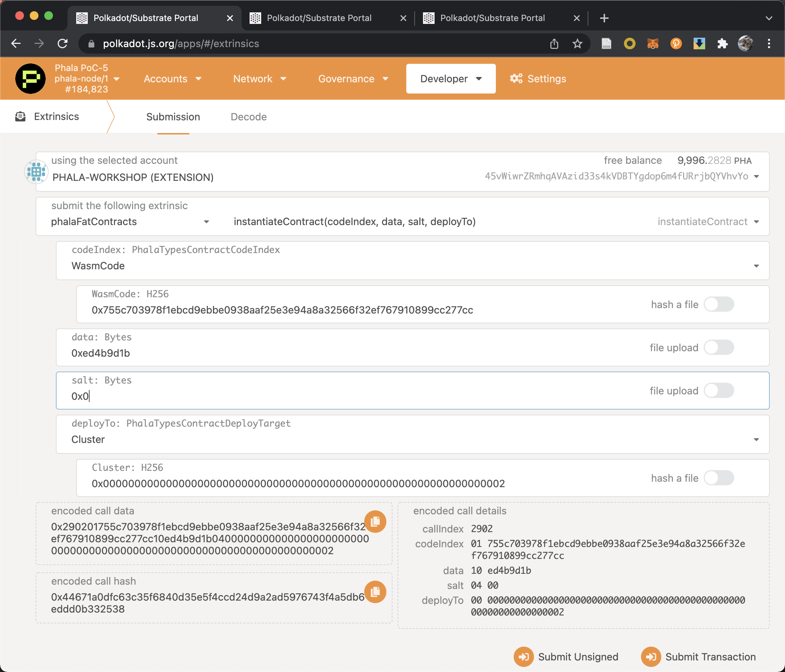
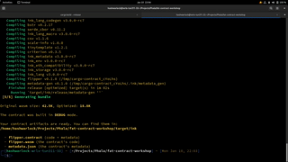
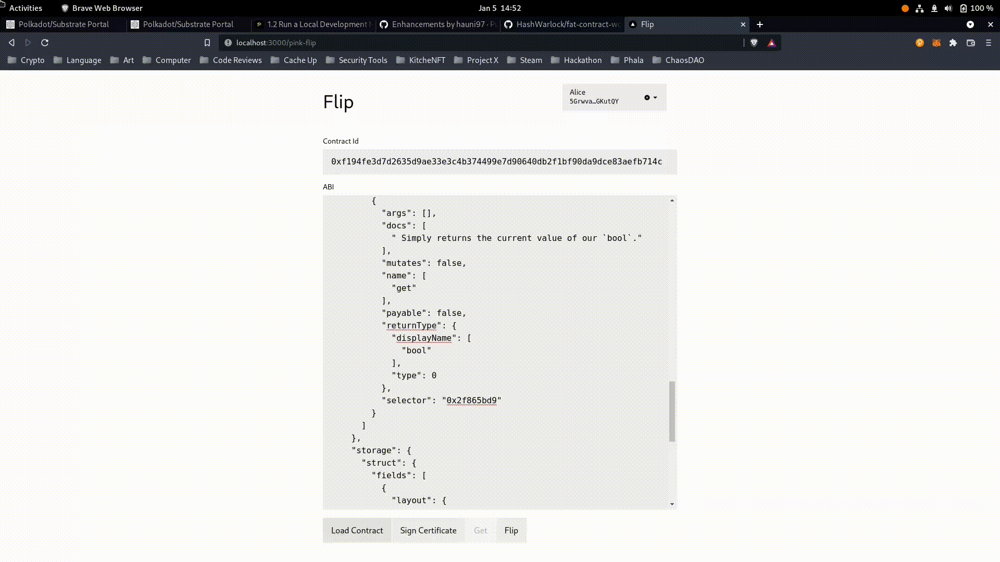
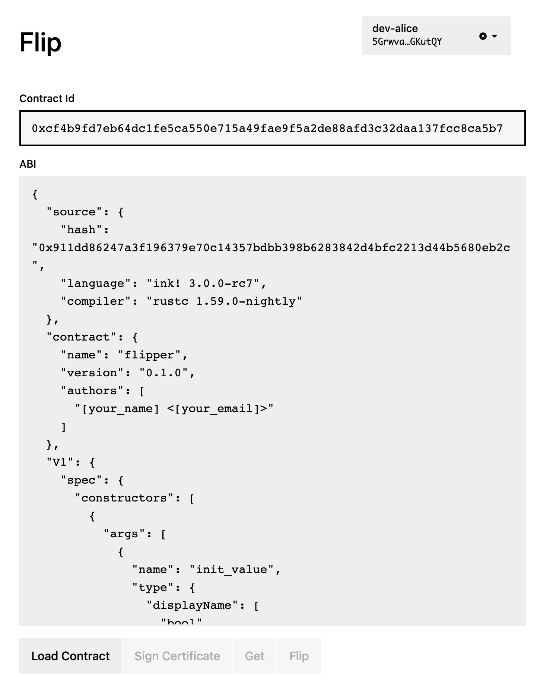

# Fat Contract Workshop

This is a workshop demonstrating how to write a *Fat Contract* with its HTTP request capability on Phala.

## Introduction

Fat Contract is the programming model adopted by Phala Network. Fat Contract is **NOT** smart contract.

Instead, it aims to provide the rich features that ordinary smart contracts cannot offer, including:

- CPU extensive computation: exclusive off-chain execution at the full CPU speed
- Network access: the ability to send the HTTP requests
- Low latency: non-consensus-sensitive operations may not hit the blockchain at all, removing the block latency
- Strong consistency: consensus-sensitive operations remain globally consistent
- Confidentiality: contract state is hidden by default unless you specifically expose it via the read call

Fat Contract is 100% compatible with Substrate's `pallet-contracts`. It fully supports the unmodified ink! smart contracts. Therefore you can still stick to your favorite toolchain including `cargo-contract`,  `@polkadot/contract-api`, and the Polkadot.js Extension.

This workshop will demonstrate how to use Fat Contract's HTTP request capability to associate a Phala account with a Github user. Such functionality serves as the core for [Decentralized Identity (DID)](https://www.gsma.com/identity/decentralised-identity). Further, we will show how to deploy your contract in [Phala Testnet](https://polkadot.js.org/apps/?rpc=wss%3A%2F%2Fpoc5.phala.network%2Fws#/explorer) and interact with it through our [frontend SDK](https://github.com/Phala-Network/js-sdk).

## Environment Preparation

An operating system of macOS or Linux systems like Ubuntu 18.04/20.04 is recommended for the workshop.
- For macOS users, we recommend to use the Homebrew package manager to install the dependencies
- For other Linux distribution users, use the package manager with the system like Apt/Yum

The following toolchains are needed:

- Rust toolchain
    - Install rustup, rustup is the "package manager" of different versions of Rust compilers: `curl --proto '=https' --tlsv1.2 -sSf https://sh.rustup.rs | sh`
    - This will install `rustup` and `cargo`
- Ink! Contract toolchain
    - Install [binaryen](https://github.com/WebAssembly/binaryen) with
        - Homebrew for macOS: `brew install binaryen`
        - Apt for Ubuntu: `sudo apt install binaryen`
        - or download the [release](https://github.com/WebAssembly/binaryen/releases/tag/version_105) and put it under your $PATH
    - Install contract toolchain: `cargo install cargo-contract --force`
- Install frontend toolchain
    - Node.js (>=v14), follow the [official tutorial](https://nodejs.org/en/download/package-manager/)
    - Yarn (v1): `npm install --global yarn`

Check your installation with

```bash
$ rustup toolchain list
# stable-x86_64-unknown-linux-gnu (default)
# nightly-x86_64-unknown-linux-gnu

$ cargo --version
# cargo 1.58.0 (f01b232bc 2022-01-19)

$ cargo contract --version
# cargo-contract 0.17.0-unknown-x86_64-linux-gnu

$ node --version
# v17.5.0

$ yarn --version
# 1.22.17
```

## Create Polkadot Account to use Phala Testnet

- Install Polkadot.js extension and import the Phala gas account following the [tutorial](https://wiki.phala.network/en-us/general/applications/01-polkadot-extension/)
    - Gas account seed: `misery blind turtle lottery random chalk flight fresh cute vanish elephant defy`
- Connect to Phala Testnet
    - Open https://polkadot.js.org/apps/
    - Click left top to switch network
    - Choose `Test Networks` - `Phala(PoC 5)` and click `Switch` at the top
- Send some coins to your own account (limited, don't be evil)
    - Create your own account following [tutorial](https://wiki.phala.network/en-us/general/applications/01-polkadot-extension/#create-new-account)
    - Send some coins
    

## Play with our deployed version

- Frontend: https://phala-js-sdk-example.netlify.app/

    1. Connect your wallet
    2. Load the deployed contract
        - Substrate endpoint: `wss://poc5.phala.network/ws`
        - Secure Worker endpoints: `https://poc5.phala.network/tee-api-{n}` (n = 1 to 8)
        - Contract ID: `0x56fd8aa93c5bf2d54aac23398777077f24404527c4a495376170d2c8535722cc`
        - ABI: copy from `metadata.json` ([prebuilt copy](https://gist.githubusercontent.com/h4x3rotab/4a55b7c6ac9ad50f2f803a1edc93456e/raw/12e0b2d8afacba2fb8de664744fb64c6ed507290/metadata.json))
    3. Click `Sign a Certificate`, this will generate a certificate to encrypt your traffic to/from the contract
    4. Follow the instruction, copy the contents and create a *public* Github Gist with it
    5. Open the **RAW** file, and copy the link
    
    6. Paste the link to the box and click `Verify`
    7. The redeem code box in will refresh every 5s. It should show your code once the verification is successful

## Compile the contract

```bash
cargo +nightly contract build
```

Also test to ensure everything is fine

```bash
cargo +nightly contract test
```

You will find the compile result at `./target/ink`:

```bash
$ ls -h target/ink
# fat_sample.wasm  metadata.json ...
```

## Deploy

Collect the above two files and create the contract in Phala Testnet (PoC 5). The contract deployment can be divided into two steps: code upload and contract instantiation.

We recommend to keep a tab for explorer so you will not miss any historical events.

### Code upload

Choose `Developer` - `Extrinsics`, and select the extrinsic `phalaFatContracts` and `uploadCode`, drag the `fat_sample.wasm` file and send the transaction.



A event of `phalaFatContracts.CodeUploaded` should be observed in the block explorer with the code hash, also you can go to `Developer` - `Chain state` and select the extrinsic `phalaFatContracts` and `code` to see the existing code.

Code upload could failed if the wasm code is already on chain.

### Contract instantiation

Choose `Developer` - `Extrinsics`, and select the extrinsic `phalaFatContracts` and `instantiateCode`. We explain the arguments as follow:
- `codeIndex`: the code to use, choose `WasmCode` and type in the hash of you uploaded code
- `data`: the instantiation argument. We shall call the constructor function of the contract will the specific function selector, This can be found in the `metadata.json` (in this case, `0xed4b9d1b`)
```json
...
    "constructors": [
    {
        "args": [],
        "docs": [],
        "label": "default",
        "payable": false,
        "selector": "0xed4b9d1b"
    }
],
...
```
- `salt`: some random bytes to prevent collision, like `0x0` or `0x1234`
- `deployTo`: we have prepared a cluster with `0x0000000000000000000000000000000000000000000000000000000000000002`. In the future, customized cluster will be enabled.



There are three events to observe, all these events contain your contract ID

- `phalaFatContracts.Instantiating`, the chain has receive your request and start instanting
- `phalaFatContracts.PubkeyAvailable`, the gatekeeper has generated the contract key to encrypt its state and input/output
- `phalaFatContracts.Instantiated`, your contract is successfully instantiated

You can go to `Developer` - `Chain state` and select the extrinsic `phalaFatContracts` and `contracts` to see all the contracts.

> Handle instantiation failure: For now, the contract execution log is not directly available to the developers. Join our [Discord](https://discord.gg/myBmQu5) and we can help forward the Worker logs if necessary.

## Interact with the contract

### Prerequest

1. Install Node (>= v14) and yarn.
2. Download and build Phala-Network/js-sdk (**fat-contract-workshop** branch)

    ```sh
    git clone --branch fat-contract-workshop https://github.com/Phala-Network/js-sdk.git
    ```

3. Edit `./packages/example/.env` to set the API endpoints. If you run a customized deployment please adjust according to your configuration:

    ```
    NEXT_PUBLIC_BASE_URL=http://localhost:8000
    NEXT_PUBLIC_WS_ENDPOINT=ws://localhost:9944
    ```

4. Compile and run the frontend. By default it will serve the app at <http://localhost:3000>:

    ```sh
    yarn
    yarn dev
    ```

### Interact

Open the app in your browser. You can use it to flip the bit in the flipper contract, and read the current boolean value in the contract.

1. Authorize the app for the Polkadot.js Extension access via the pop-up window
2. Choose an account with some balances (Alice or Bob) in the right-top drop-down
3. Click "Sign Certificate"

    > This step is necessary for Fat Contract Dapp because we use a certificate chain to do end-to-end encryption. Whenever you selected a new account, just sign a new certificate.

4. Paste the content of `metadata.json` to the ABI text box, and enter the contract id

    > Every time when you deploy a new contract, you will need to update the ABI and the contract address.

    > 
5. Click "Query" to call `get()`, and read the value
6. Click "Command" to call `flip()`
7. After around 6s, click "Query" to call `get()`. You should read a flipped value.

    > The 6s delay is due to the block finalization.

    > 



## Challenge: "Secret" Flipper

We leave a challenge for you to explore the confidentiality of Phala's Fat Contract.

### How is it possible?

Fat Contracts are confidential by default. All the contract inputs, outputs, and states are encrypted. The data is only decrypted after arriving at the [Secure Enclave](https://www.anjuna.io/what-is-a-secure-enclave) (where the contract executor runs). As a result, although you can see the transactions and storage on the blockchain, they are just encrypted data.

So the only way to read some data from the contract is to send a **query**.

The query is not only end-to-end encrypted but also signed with your wallet key. In this way, the identity is attached to a query. With the signature attached, the ink! contract can determine the identity of the sender. This is done via the Phala Fat Contract executor, who validates the signature before running the contract.

More specifically, in an ink! query function, you determine the response based on the sender securely:

```rust
pub fn get(&self) -> Option<bool> {
    if self.env().caller() == self.admin {
        // The caller is the admin. Let's return some result
        // ...
    } else {
        // Otherwise, we can return something else
        // ...
    }
}
```

### Why cannot the vanilla ink! support storing secret?

In the vanilla ink! smart contract, each "query" also comes with a sender. The above code can of course compile and execute without any error.

However, it doesn't protect any secret. The sender field in the query is just an account (public key). In other words, anyone can feel free to specify any account as the query sender. The blockchain node doesn't require the sender to sign the query with its wallet.

Indeed, it doesn't make a lot of sense to require the signature. In an ordinary blockchain, all the data must be transparent and shared between all the nodes, as required by the consensus mechanism. As long as you run a full node, you get a full copy of the blockchain database. The query function just reads the data from the blockchain. Assuming we add the signature check just like what we do in Fat Contract, anyone can still make a modified version of the client to perform the query function to bypass any check. However, this doesn't work at Phala Network, because only an unmodified worker program (pRuntime) running in a canonical Secure Enclave can load the contract and get the key to decrypt the contract data. The Secure Enclave provides a strong layer of protection.

### Exercise

1. Modify the `get()` function in the Flipper contract to only return the result to the contract deployer, otherwise return an empty result
2. Change the js-app frontend and test it with two accounts (Alice to deploy the contract, and Bob to read the contract)

> Tip: After you have changed the return type of `get()` function, please don't forget to redeploy the contract, and replace the ABI in the frontend app.

### Solution

Please check the `solution` branch.

## Appendix

### Polkadot.js Extension and the common seeds

Phala App only accepts the official [Polkadot.js Extension](https://polkadot.js.org/extension/) as the wallet provider. In the local testnet, there are a few built-in well-known accounts for testing. To access them from the Polkadot.js Extension, you should import them to the extension with their raw seed. It's suggested to import at least Alice and Bob:

| Key       | Raw seed                                                           |
|-----------|--------------------------------------------------------------------|
| //Alice   | 0xe5be9a5092b81bca64be81d212e7f2f9eba183bb7a90954f7b76361f6edb5c0a |
| //Bob     | 0x398f0c28f98885e046333d4a41c19cee4c37368a9832c6502f6cfd182e2aef89 |
| //Charlie | 0xbc1ede780f784bb6991a585e4f6e61522c14e1cae6ad0895fb57b9a205a8f938 |
| //Dave    | 0x868020ae0687dda7d57565093a69090211449845a7e11453612800b663307246 |
